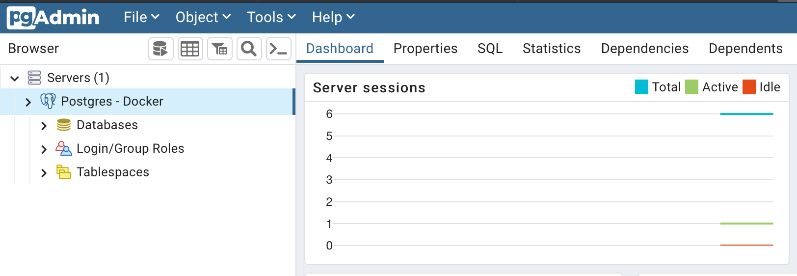

# docker-compose workflow for local rails environment

## Overview

Taking a bit of inspiration from the [3musketeers initiative](https://3musketeers.io), I have spent some time mucking about with rails envrionments

Requirements:
- [docker](https://docs.docker.com/engine/installation/)
- [docker-compose](https://docs.docker.com/compose/install/)
- [make](https://www.gnu.org/software/make/)

This repo creates a local environment with docker-compose which provides you with the following:

- Templated local.env file via makefile reading dev.makerc
- Templated pgpass and servers.json file
- PostgreSQL instance with username & pass set up for you 
    - Same password provided to rails app via the environment variables:
      - `RAILS_DB_HOST`
      - `POSTGRES_USER`
      - `POSTGRES_PASSWORD`
    - Note: You will need to ensure that `config/database.yml` are reading these variables
- pgAdmin in DESKTOP mode [running on port 8080](localhost:8080), no password required
  - automatically imported credentials for the db connection string, no configuration required. Just expand and go straight into the db!  Wow, magic 🌈. 
  ***Certainly not a massive pain in the backside to get it work, I'm not annoyed whilst writing this. Not at all***
- Most importantly, cringe command output emojiis.

## Key areas in the repo
The following are to note within the repo:
- makefile
- .dev.makerc
- Dockerfile
- docker-compose.yml
- .docker/templates

P.S. I have made a copy of all of these under `docs/important-files` to grab in an easier fashion if you want to chuck them in your own repo.

## How to work this example repo

If you follow the makefile structure, essentially the main use of it is for devs to easily set up a local environment with one command, and bin it with only one more.

There's a requirement to pass a BUILD_ENV variable upon calling make, this is to allow additional logic later on if different local environments need to be catered for. Setting this to `local` ensures the .dev.makerc file is read.

However pipelines should be getting their variables elsewhere via secrets etc.

### Running make build

#### Creating Templates
So running `BUILD_ENV=local make build` will kick off creating template files for you, this will create a local.env file in the root of the repo, as well as create:
- `.docker/pgadmin/pgpass`
- `.docker/pgadmin/servers.json`

```sh
BUILD_ENV=local make init

Creating local.env 🏡
Creating pgpass credentials 🔑
Creating pgadmin server connection string 🔗
```

These are mounted to the pgadmin container to autocreate your connection to the postgres db:

```docker
pgadmin:
    image: dpage/pgadmin4 # No constraint on image version, consider later
    env_file:
      - ./local.env
    ports:
      - "8080:80"
    volumes:
      - ./.docker/pgadmin/servers.json:/pgadmin4/servers.json # Imports the db information for you
      - ./.docker/pgadmin/pgpass:/pgadmin4/pgpass # Stores the password to save you putting it in
    # Permission related issues around reading the pgpass file
    entrypoint: >
      /bin/sh -c "
      cp -f /pgadmin4/pgpass /var/lib/pgadmin/;
      chmod 600 /var/lib/pgadmin/pgpass;
      chown pgadmin:pgadmin /var/lib/pgadmin/pgpass;
      /entrypoint.sh
      "
    depends_on:
      postgres:
        condition: service_started
```
You will also notice a custom entrypoint, this is because pgAdmin reads pgpass files relative to the logged in user, so you have to faff about moving it to a common location that's accessible by that user. But also changing the permissions of the file to be 600.

#### docker-compose build
The next step will perform docker build, passing through the ruby image version via the local.env file templated via .dev.makerc. There is an assumption to assume "latest" if the argument is not passed to the dockerfile.

The dockerfile itself will copy the contents of the repo, ignoring whatever is specified in the .dockerignore file. **Ensure nothing sensitive can be built into these containers**

Within the context of docker-compose, it will mount the local repo under `/app`
It will also spin up a postgresql instance, accessible via the ruby image with your code in. So don't `rm -rf` anything you haven't commited or you're gonna have a bad time.

```
Building Docker images (silently, might take a while) 🛠:
Starting Docker services 🏁:
[+] Running 4/4
 ⠿ Network docker_rails_default       Created   0.0s
 ⠿ Container docker_rails-postgres-1  Started   0.4s
 ⠿ Container docker_rails-web-1       Started   0.8s
 ⠿ Container docker_rails-pgadmin-1   Started   0.6s
 ```

 #### Creating initial database
 Once the containers are created, running and networked with each other. There is a step that simply runs the `rake db:create` command inside the rails container. It's not strictly necessary, however it saves you seeing an error and manually clicking "create DB" upon viewing the default rails application

 ```
 Creating inital database for application 🔁
[+] Running 1/0
 ⠿ Container docker_rails-postgres-1  Running   0.0s
Database 'development' already exists
Database 'test' already exists
```

#### Viewing Rails & pgAdmin

That's it, your DB and web app is all set up and ready to break. You can view the rails app over [localhost:3000](http://localhost:3000) and pgAdmin over [localhost:8080](http://localhost:8080)

#### Interacting with the containers
There's two make targets included that will spawn shells within the web and db containers for any debugging you need:
```make
db-logs:
	@docker-compose logs -f postgres

db-shell:
	@docker-compose exec -it postgres /bin/sh

web-logs:
	@docker-compose logs -f web

web-shell:
	@docker-compose exec -it web /bin/sh
```
As mentioned earlier your repo is mounted under the current working directory of the rails container, so if you need to make any rails commands to create a new models etc, do it within the container to keep your Ruby environment consistent & avoid potential incompatabilites between other people.

#### Stopping

Stopping the stack is just as easy as starting it, just run `BUILD_ENV=local make stop` and it'll be gone in no time

Sometimes the server pid file doesn't remove itself, even after the container gracefully stops. There is a step to delete this for you if it still exists after the stop command.

```sh
BUILD_ENV=local make stop     
Stopping Docker services 🛑:
[+] Running 5/4
 ⠿ Container docker_rails-pgadmin-1             Removed 0.8s
 ⠿ Container docker_rails_web_run_a0b9624ca0d6  Removed 0.0s
 ⠿ Container docker_rails-web-1                 Removed 10.2s
 ⠿ Container docker_rails-postgres-1            Removed 0.2s
 ⠿ Network docker_rails_default                 Removed 0.1s
Deleting stale pidfile
tmp/pids/server.pid
```

## That's a wrap
There's still a lot of improvement to do with this, there's still quite a few assumptions made and I'm sure my makefile could be a lot more well polished than it is.
But if it's been any help for you, fantastic.